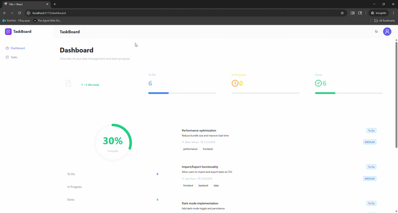

# Task Management System

A comprehensive Task Management application built with React 18, Redux Toolkit, and Ant Design. This project demonstrates modern React development practices with full TypeScript support, efficient state management, and comprehensive testing.

## Tech Stack

- **React 18**
- **Vite**
- **Redux Toolkit (RTK)**
- **React Redux**
- **React Router v7**
- **Tailwind CSS v4**
- **Ant Design**
- **TypeScript**
- **Sass**
- **ESLint**
- **Prettier**
- **.env** environment variable support

## Folder Structure

```
src/
├── assets/          # Static assets like images, icons, etc.
├── components/ui/   # Reusable UI components
├── layouts/         # Layout components (e.g., AuthLayout, MainLayout)
├── middlewares/     # Custom route middlewares (e.g., ProtectedRoute)
├── pages/           # Application pages (e.g., LoginPage, DashboardPage)
├── services/        # API service files (e.g., authApi, userApi)
├── store/           # Redux store configuration and slices
├── types/           # TypeScript type definitions
├── utils/           # Utility functions (e.g., axios, storage helpers)
├── App.tsx          # Main application component
├── main.tsx         # Application entry point
├── index.css        # Global styles
```

## Features

### 🎯 Core Features

#### 1. **Dashboard Page**
- **4 Statistics Cards** (Ant Design Statistic + Card components):
  - Total Tasks with trend indicator
  - To Do tasks with progress bar
  - In Progress tasks with progress bar
  - Done tasks with progress bar
- **Overall Progress Visualization**:
  - Circular progress indicator showing completion percentage
  - Status breakdown with color-coded segments
  - Task distribution bar chart
- **Recent Tasks List**:
  - Display 5 most recently created tasks
  - Real-time data from Redux selectors
  - Color-coded status indicators
  - Priority tags with appropriate colors
- **Responsive Grid Layout** using Tailwind CSS

#### 2. **Task Management Page**

##### Task Table Features:
- **Ant Design Table** with advanced features:
  - Pagination: 10 items per page
  - Total records display
  - Row selection for bulk operations
- **Table Columns**:
  - Title (sortable)
  - Status (inline select for quick updates)
  - Priority (color-coded tags: high=red, medium=yellow, low=green)
  - Assignee
  - Due Date (sortable)
  - Actions (Edit/Delete dropdown)
- **Sorting Capabilities**:
  - Sort by Title (alphabetical)
  - Sort by Due Date (chronological)
  - Sort by Priority (high → medium → low)
- **Status Tags** (Ant Design Tag):
  - `todo` → default (blue)
  - `in_progress` → processing (orange)
  - `done` → success (green)

##### Task Creation & Editing:
- **Modal Form** for creating and editing tasks
- Opens via "Add New Task" button or row-level Edit button
- Auto-populated fields when editing existing tasks
- **Form Fields**:
  - Title — Input, required
  - Description — Textarea, optional
  - Status — Select, required
  - Priority — Select, required
  - Assignee — Input, optional
  - Due Date — DatePicker, optional
  - Tags — Select with `mode='tags'`, optional
- **Validation**: Ant Design Form rules with clear error messages

##### Delete Operations:
- Single task deletion with confirmation modal
- Bulk deletion with row selection
- Delete count display in confirmation

##### Quick Status Update:
- Inline Select in Status column
- Update task status without opening modal

#### 3. **Search & Filters**

- **Search by Title**:
  - Ant Design Input.Search component
  - 300ms debounce for performance
  - Searches in title, description, and assignee
- **Multi-select Status Filter**:
  - Filter by one or multiple statuses
  - Real-time updates
- **Priority Filter**:
  - Single-select dropdown
  - Filter by low/medium/high priority
- **Date Range Filter**:
  - Ant Design DatePicker.RangePicker
  - Filter tasks by due date range
- **Reset Filters**:
  - One-click reset button
  - Clears all active filters
- **All filtering logic in Redux selectors** (not in components)

#### 4. **Redux Toolkit Implementation**

##### tasksSlice.ts:
- **State Structure**:
  ```typescript
  {
    items: Task[],
    filters: {
      searchText: string,
      status: string[],
      priority: string,
      dateRange: [string, string]
    },
    pagination: {
      currentPage: number,
      pageSize: number,
      total: number
    }
  }
  ```
- **Actions**:
  - `addTask` - Create new task
  - `updateTask` - Update existing task
  - `deleteTask` - Delete single task
  - `deleteManyTasks` - Bulk delete
  - `updateTaskStatus` - Quick status change
  - `setFilter` - Update filter criteria
  - `resetFilters` - Clear all filters
  - `setPage` - Change current page

##### Selectors (using createSelector for memoization):
- `selectAllTasks` - All tasks
- `selectFilteredTasks` - Tasks after applying filters
- `selectPaginatedTasks` - Tasks for current page
- `selectTaskStats` - Statistics: `{ total, todo, in_progress, done }`
- `selectRecentTasks` - 5 most recently created tasks

### 🧪 Testing

- Comprehensive test suite for Redux selectors
- Tests for filtering logic (search, status, priority, date range)
- Tests for sorting functionality
- Tests for statistics calculation
- Tests for recent tasks selector
- Vitest with jsdom for component testing

### 🎨 UI/UX Features

- Modern dark theme design
- Smooth transitions and animations
- Responsive layout (mobile-friendly)
- Color-coded status and priority indicators
- Hover effects and interactive elements
- Loading states and error handling

## Getting Started

Follow these steps to get started with the project:

1. **Clone the repository:**

   ```bash
   git clone <repository-url>
   cd "fe-test-Ngô Hữu Nam"
   ```

2. **Install dependencies:**

   ```bash
   npm install
   # or
   yarn install
   ```

3. **Run the development server:**

   ```bash
   npm run dev
   # or
   yarn dev
   ```

   The application will be available at `http://localhost:5173`

4. **Run tests:**

   ```bash
   npm run test
   # or for UI mode
   npm run test:ui
   # or for coverage
   npm run test:coverage
   ```

5. **Build for production:**

   ```bash
   npm run build
   ```

6. **Preview the production build:**

   ```bash
   npm run preview
   ```

## 📸 Screenshots & Demo

### Dashboard

*Dashboard showing task statistics, progress visualization, and recent tasks*

### Task Management

*Task table with sorting, filtering, and pagination*

### Task Creation/Edit

*Modal form for creating and editing tasks with validation*

### Filters in Action

*Search and filter functionality with real-time updates*

> **Note**: Screenshots can be added to the `docs/screenshots/` directory. GIF demos showing interaction flows are highly recommended.

## 🎥 Demo Video



*Full application demo showing all features in action*

### Key Interaction Demos:
1. Creating a new task
2. Editing task status inline
3. Filtering and searching tasks
4. Bulk deletion
5. Responsive layout on mobile devices

## Linting

To lint your code, run:

```bash
npm run lint
```

## 📁 Project Structure

```
fe-test-Ngô Hữu Nam/
├── src/
│   ├── assets/              # Static assets (images, icons)
│   ├── components/          # Reusable UI components
│   ├── context/             # React Context providers
│   ├── features/
│   │   └── tasks/           # Task-specific components
│   │       ├── CreateTaskModal.tsx
│   │       ├── ConfirmModal.tsx
│   │       └── forms/
│   │           └── CreateTaskForm.tsx
│   ├── hooks/               # Custom React hooks
│   │   ├── useDebounceInput.ts
│   │   └── useTasksActions.ts
│   ├── layouts/             # Layout components
│   │   ├── AuthLayout.tsx
│   │   └── MainLayout.tsx
│   ├── middlewares/         # Route middlewares
│   │   └── ProtectedRoute.tsx
│   ├── pages/               # Application pages
│   │   ├── DashboardPage.tsx
│   │   ├── TaskPage.tsx
│   │   ├── LoginPage.tsx
│   │   └── RegisterPage.tsx
│   ├── services/            # API services
│   │   └── api.ts
│   ├── store/               # Redux store
│   │   ├── index.ts
│   │   ├── hooks.ts
│   │   ├── slices/
│   │   │   └── tasksSlice.ts
│   │   └── selectors/
│   │       ├── tasksSelectors.ts
│   │       └── tasksSelectors.test.ts
│   ├── types/               # TypeScript types
│   │   ├── task.ts
│   │   └── index.ts
│   ├── utils/               # Utility functions
│   │   ├── axios.ts
│   │   ├── storage.ts
│   │   └── cn.ts
│   ├── test/                # Test utilities
│   │   ├── setup.ts
│   │   └── test-utils.tsx
│   ├── seeds/               # Mock data
│   │   └── tasksMock.ts
│   ├── App.tsx              # Main app component
│   ├── main.tsx             # Entry point
│   └── index.css            # Global styles
├── public/                  # Public assets
├── docs/                    # Documentation and screenshots
│   └── screenshots/
├── vite.config.js           # Vite configuration
├── tsconfig.json            # TypeScript configuration
├── tailwind.config.js       # Tailwind CSS configuration
└── package.json             # Dependencies and scripts
```

## 🛠️ Technical Implementation Details

### State Management
- **Redux Toolkit** for predictable state management
- **Reselect** (createSelector) for memoized selectors
- Normalized state structure for optimal performance
- Type-safe actions and reducers with TypeScript

### Performance Optimizations
- Debounced search input (300ms) to reduce re-renders
- Memoized selectors to prevent unnecessary calculations
- Pagination to handle large datasets
- Lazy loading of components where applicable

### Code Quality
- **TypeScript** for type safety and better developer experience
- **ESLint** with React and TypeScript rules
- **Prettier** for consistent code formatting
- Comprehensive unit tests with **Vitest**
- Test coverage reporting

### Best Practices
- Separation of concerns (presentational vs container components)
- Custom hooks for reusable logic
- Centralized state management
- Consistent naming conventions
- Proper error handling and validation
- Accessibility considerations

## Key Dependencies

Here are the key dependencies used in this project:

### Core:
- `react` ^18.x - UI library
- `react-dom` ^18.x - React DOM rendering
- `react-router-dom` ^7.x - Client-side routing
- `typescript` - Type safety

### State Management:
- `@reduxjs/toolkit` ^2.8.x - Redux Toolkit for state management
- `react-redux` ^9.x - React bindings for Redux
- `reselect` - Memoized selectors (included in RTK)

### UI Framework:
- `antd` ^5.26.x - Ant Design component library
- `@ant-design/icons` - Icon components
- `tailwindcss` ^4.x - Utility-first CSS framework

### Development:
- `vite` ^7.x - Build tool and dev server
- `@vitejs/plugin-react` - Vite plugin for React
- `vitest` ^1.x - Testing framework
- `@testing-library/react` - React testing utilities
- `@testing-library/jest-dom` - Custom Jest matchers
- `jsdom` - DOM implementation for testing

### Utilities:
- `axios` ^1.x - HTTP client
- `dayjs` - Date manipulation
- `clsx` / `tailwind-merge` - Conditional className utility

## 🚀 Available Scripts

```bash
# Development
npm run dev          # Start development server

# Build
npm run build        # Build for production
npm run preview      # Preview production build

# Testing
npm run test         # Run tests
npm run test:ui      # Run tests with UI
npm run test:coverage # Run tests with coverage report

# Code Quality
npm run lint         # Run ESLint
```

## 📝 Git Commit History

The project follows a clean commit history with feature-based commits:

1. `chore: setup project configuration and dependencies`
2. `feat: configure build tools and TypeScript`
3. `feat: optimize Dashboard with Redux selectors`
4. `feat: add table sorting functionality`
5. `test: add comprehensive tests for Redux selectors`

View full commit history:
```bash
git log --oneline
```

## 🤝 Contributing

Contributions are welcome! Please follow these guidelines:

1. Fork the repository
2. Create a feature branch (`git checkout -b feature/AmazingFeature`)
3. Commit your changes with clear messages
4. Push to the branch (`git push origin feature/AmazingFeature`)
5. Open a Pull Request

### Commit Message Convention:
- `feat:` - New feature
- `fix:` - Bug fix
- `docs:` - Documentation changes
- `style:` - Code style changes (formatting, etc.)
- `refactor:` - Code refactoring
- `test:` - Adding or updating tests
- `chore:` - Maintenance tasks

## 📄 License

This project is licensed under the MIT License.

## 👨‍💻 Author

**Ngô Hữu Nam**

## 🙏 Acknowledgments

- React Team for the amazing framework
- Ant Design Team for the comprehensive UI library
- Redux Toolkit Team for simplified state management
- All open-source contributors
- `vite`: ^4.x
- `@reduxjs/toolkit`: ^2.x
- `react-redux`: ^9.x
- `react-router-dom`: ^7.x
- `tailwindcss`: ^4.x
- `antd`: ^5.x
- `typescript`: ^4.x
- `sass`: ^1.x
- `eslint`: ^9.x

## License

This project is licensed under the MIT License. See the LICENSE file for details.

## Author

This boilerplate was created and maintained by **Kausar Ansari**.

- [GitHub](https://github.com/kausaransari)
- [LinkedIn](https://www.linkedin.com/in/kausar-ansari-754533234/)
